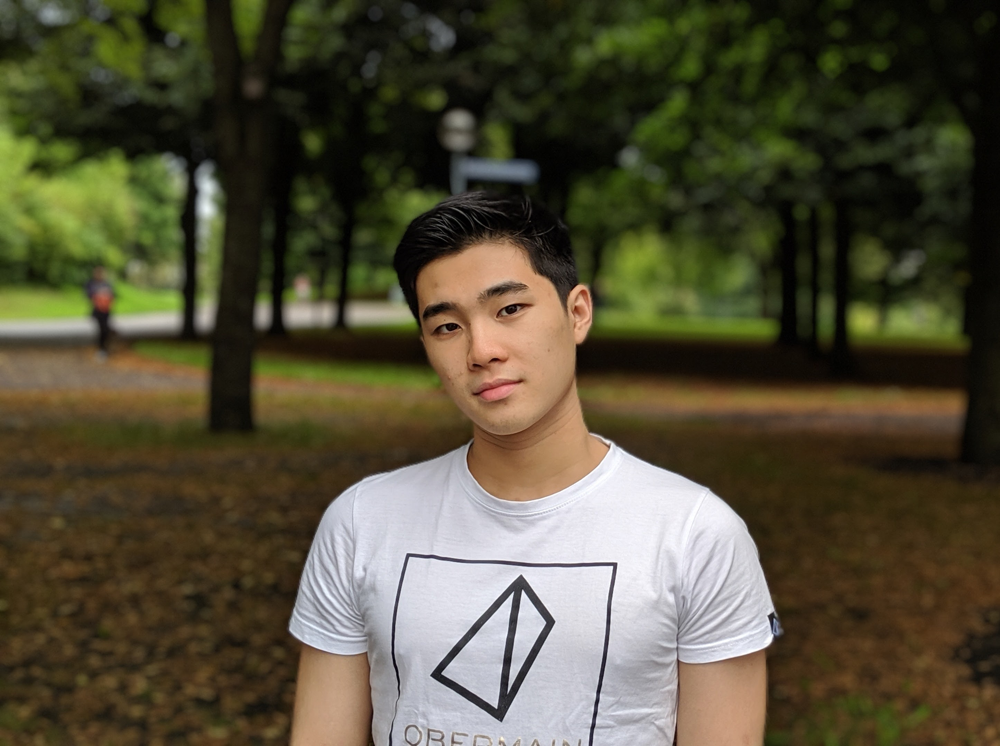
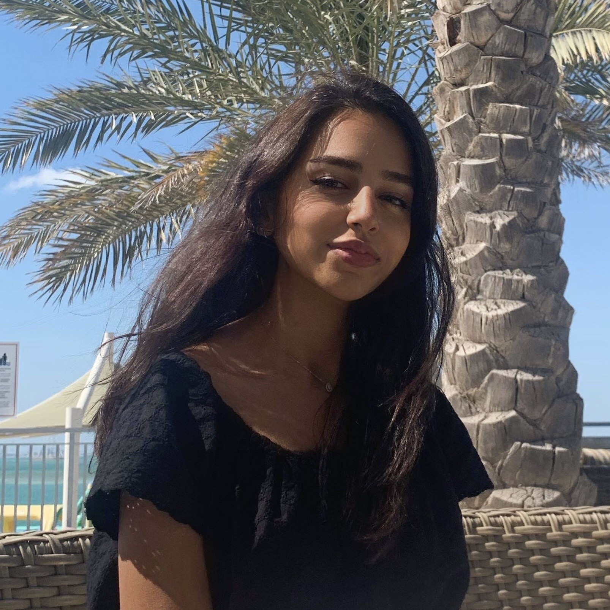
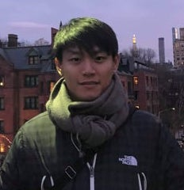
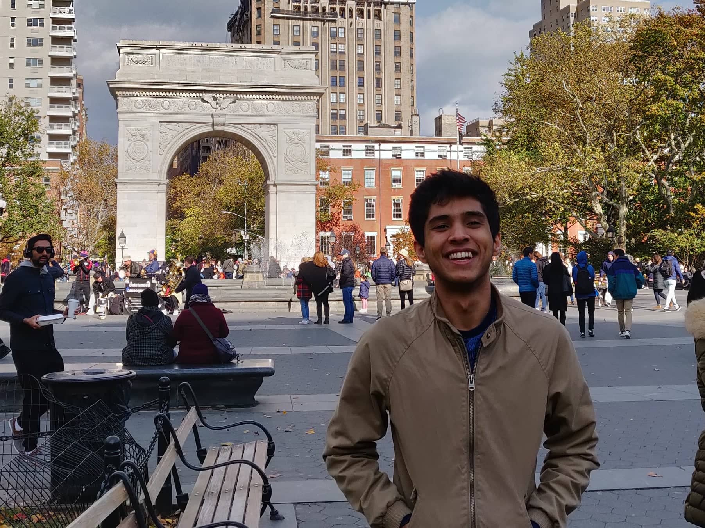
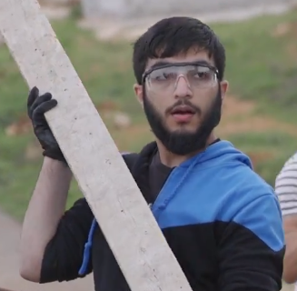

#### meet your **bioengineering** rep :syringe:
##### Ansen Zhi-Han Lai

Hi, I am Ansen Zhi-Han Lai, a student planning to major in Bioengineering. For the past 2 years, I have been working closely alongside Bioengineering professors, trying my best to answer student questions and concerns, as well as provide suggestions on this upcoming major! Because this is a new and upcoming major here, there is inevitably a level of uncertainty when it comes to course structure and offerings, so please do reach out to me anytime you need any help. Last semester, we have accomplished a lot together, opening 3 Bioengineering-specific courses, as well as hosted a student townhall. I look forwards to have you join us in this exciting journey!

Although I am originally from Taiwan, I grew up in a few different countries, making me especially interested in unique and local cuisines and snacks. Above all, I am a huge fan of architecture and design, which makes Dubai one of my favorite places in the world to go to. Feel free to chat me up anytime.

 
 

#### meet your **mechanical engineering** rep :gear:
##### Mareya Khouri

Hi! I’m a junior majoring in Mechanical Engineering with interests in Aerospace, Visual Arts, and Design. I was born and raised in Abu Dhabi and have been deeply moved by the diverse characters, moods, and scenes this multidimensional, remolding city has to offer. When I grow up, I want to become an astronaut as I am fascinated by the idea of living in space and terraforming planets to make them more habitable — I wrote a cool paper on birth and fetal development in outer space!

In my free time, I enjoy boxing, listening to podcasts, playing Call of Duty, speedcubing, and critiquing art. You’ll usually find me under the palm trees or on the pitch training with the football team. Please reach out with any questions you have about Mechanical Engineering, or anything else. I would love to support you in any way that I can!

 
 

#### meet your **civil engineering** rep :construction:
##### Sungmin Sohn

Hi! My name is Sungmin Sohn, a senior majoring in Civil Engineering (I also intended to minor in design but did not have enough credit to finish it…please feel free though for any design related questions as well!). I am from Korea but lived in Abu Dhabi since I was in grade 10. I have also done two years of research as well as summer researches in fields of material science and transportation & traffic engineering.

In addition to being a civil engineering representative, I am also a president of the ASCE NYUAD chapter. ASCE stands for American Society for Civil Engineers which DO NOT mean that you would have to be an American to be part of our community. In ASCE we not only share the internship opportunities but we share our interest, experience, and information that could really help you navigate your future as a civil engineering student. I hope you guys could join us and really help yourself with making decisions. Also, it would be so helpful to get to as know more upperclassman civil engineering students and professors!

Just remember that Civil Engineering is not only about building bridges! There are so many other things that you can do as a civil engineer. If you are interested, please do not hesitate to talk to me! Feel free to ask really about anything, I would love to answer any and all of your questions.

 
 

#### meet your **computer engineering** rep :computer:
##### Nishant Aswani

Heylo! I'm a senior majoring in Computer Engineering who was once absolutely clueless about his major. I figured out I wanted to do engineering in sophomore year (yeah, it's possible!) and ~coding~ sounded so cool (at the time), and here I am. I was born in Jaipur but have spent my entire pre-NYUAD life in Shenzhen, like 15 minutes away from Huaqiangbei! My ears usually perk up when I hear about automation or autonomous systems, or really most things computing. I try to keep myself occupied with a couple projects at any given moment, so *always* feel free to bug me about them! I also love curating Spotify playlists and when hit with inspiration will even make some playlist art for them. Otherwise, I'm buying an Americano, watching YouTube, or petting campus cats. Occasionally, I'm telling someone about how I miss living somewhere with a metro system.

As the computer engineering rep, I hope to help peers better understand what the major is all about, build some infrastructure for internships/off-campus opportunities, and help connect students to other amazing peers/resources! Happy to help whenever I can!

 
 

#### meet your **electrical engineering** rep :zap:
##### Rumail Memon

 
 
