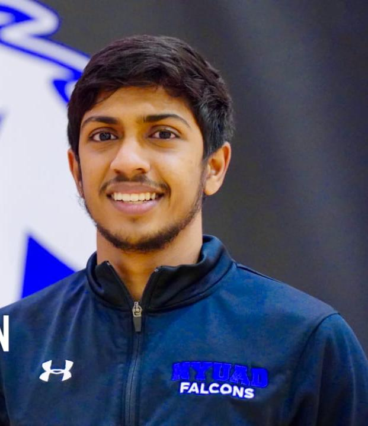
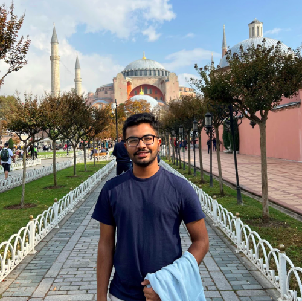
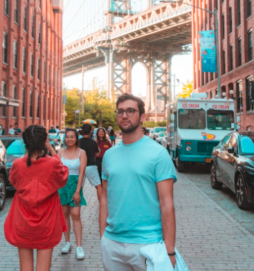

#### meet your **engineering** rep and committee chair :gear:
##### Maya Fayed

Hey there! I’m Maya and I’m a senior majoring in computer engineering. Home for me is Alexandria, Egypt and I’ve lived there all my life before coming to NYUAD. In terms of academic interests, I’m passionate about responsible tech as well as pursuing interdisciplinary work that leverages machine learning and data-driven engineering techniques for health and social impact applications. 
When I’m not coding, you can find me playing frisbee or struggling on the rock climbing wall;) Feel free to reach out to me with any questions or just to chat about any of these topics!

 
 
 
 
 
 
 
 
 
 

#### meet your **electrical engineering** rep :zap:
##### Rameen Mahmood

Hi I’m Rameen! I’m a senior majoring in Electrical Engineering. I’m from Islamabad, Pakistan 🇵🇰 I’m interested in machine learning for health care and exploring challenges in deep learning. I’m super passionate about representation and gender diversity in STEM. 
 
 

I also love avocado toast 🥑 and matcha 🍵. Feel free to contact me with any of the topics above! 
 
 
 
 
 
 

 
 

 
 

#### meet your **bioengineering** rep :syringe:
##### Abhay Menon

Hey! I am Abhay Menon, a rising junior majoring in BioEngineering. I am from Chennai, India and have lived there all my life before coming to NYUAD. I decided to major in BioEngineering because it applies engineering tools and approaches to find unique solutions to problems in biology and medicine. The field of bioengineering is very broad but my research interests lie primarily in visual prosthesis, bionic implants and creating more effective point of care diagnostic tools. 

I am a huge sports fan and spend most of my spare time playing basketball. With BioEngineering being a new major, if you have any questions regarding courses, professors or anything at all feel free to hit me up!

 
 
 
 

#### meet your **mechanical engineering** rep :gear:
##### Aayush Karna

Hello ! I’m Aayush and I’m a senior majoring in Mechanical Engineering from Kathmandu, Nepal. My interests lie in 3D designing, computational fluid dynamics and aeroacoustics. 
 
 
Feel free to contact me with any questions related to mechanical engineering at NYUAD. 

 
 
 
 
 
 
 
 
 
 

#### meet your **civil engineering** rep :construction:
##### Tedi Hondro

Hey! This is Tedi and I am a senior majoring in Civil Engineering. I have a broad spectrum of interests but first place is taken by biomimicry in creating architecture and design which I believe will be a key to a more energy efficient future. 
 
 
Feel free to contact me for any questions or my take on why engineering students are the best procrastinators. `\_(○×○)_/` 

 
 
 
 

