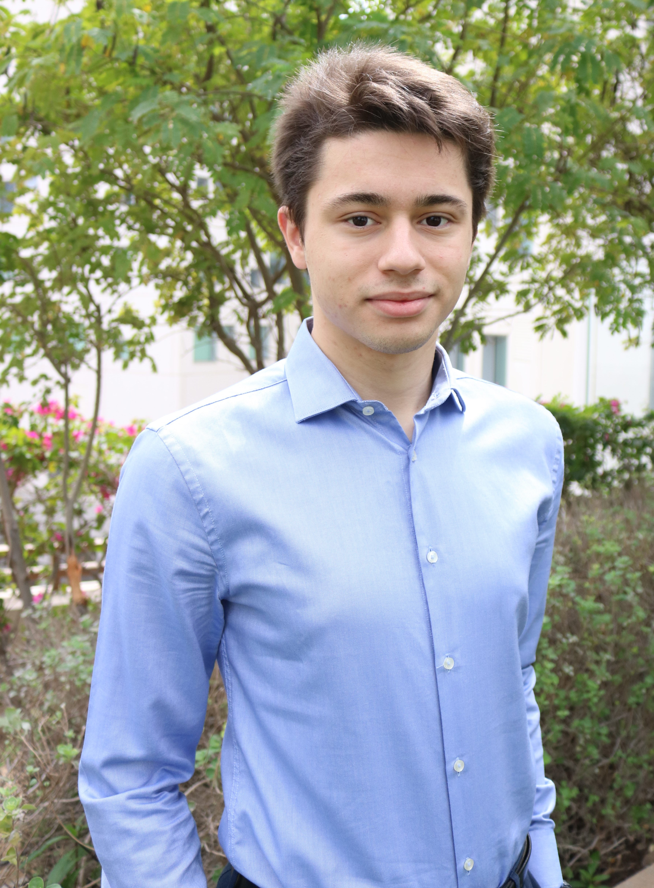
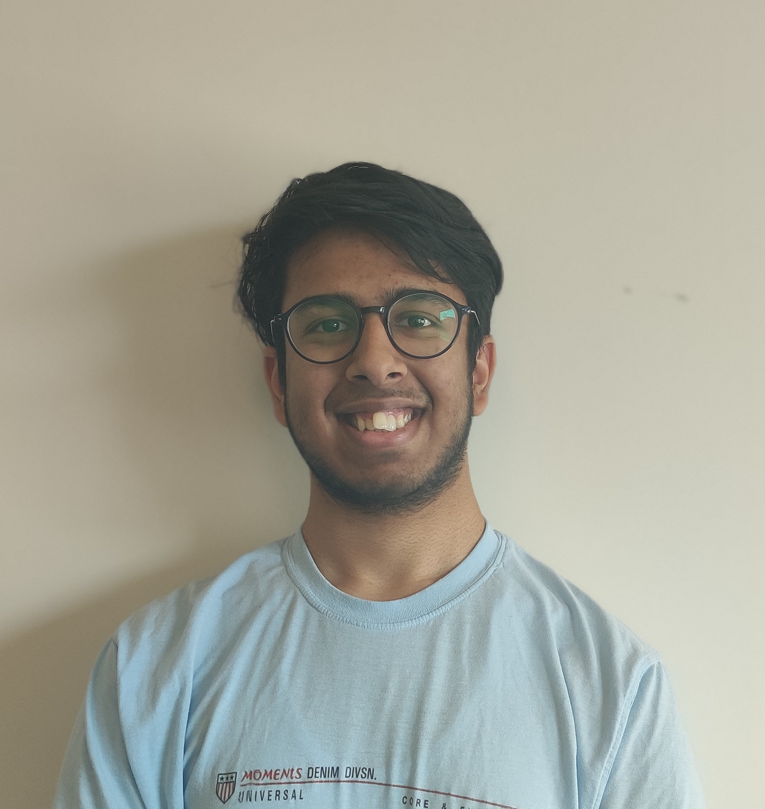
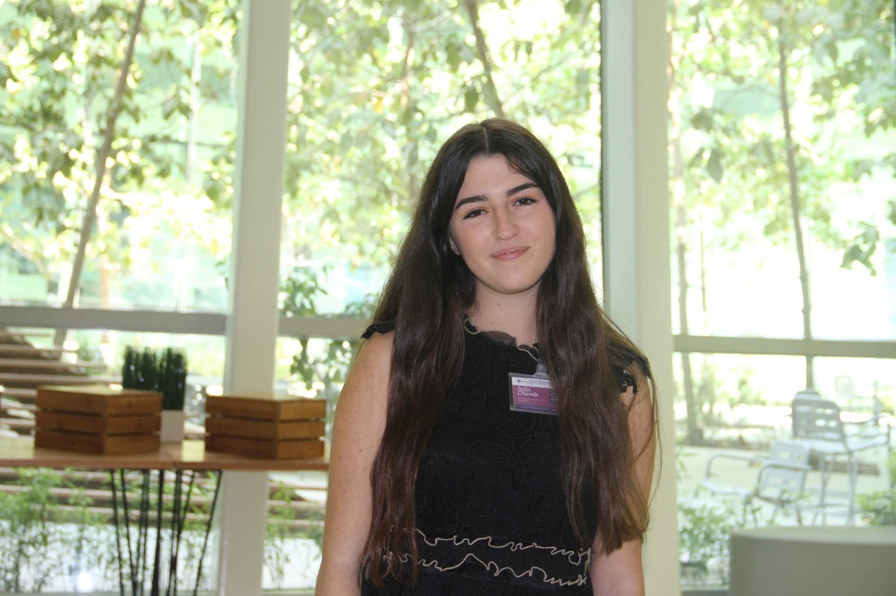

#### meet your **mechanical engineering** rep :gear:
##### Maya Fayed

Hey there! I’m Maya and I’m a rising junior majoring in computer engineering. Home for me is Alexandria, Egypt and I’ve lived there all my life before coming to NYUAD. While my interest in computer engineering lies primarily within the software side, I chose this major because it allows me to supplement my knowledge of software with very interesting hardware areas such as embedded systems and hardware security. In terms of my academic interests, these range from cybersecurity to computational social science and data visualization. I’m also particularly enthusiastic about tackling questions of tech ethics surrounding AI and autonomous systems.

If you’re interested in any of these topics or have questions about compE at NYUAD, big or small, definitely feel free to reach out! I spend most of my downtime between Blacksmith and random coffee shops around the city so I’d love to grab a cup of coffee sometime and discuss any concerns you might have :) 

 
 
 
 

##### Rameen Mahmood

Hi I’m Rameen! I’m a senior majoring in Electrical Engineering. I’m from Islamabad, Pakistan 🇵🇰 I’m interested in machine learning for health care and exploring challenges in deep learning. I’m super passionate about representation and gender diversity in STEM. 
I also love avocado toast 🥑 and matcha 🍵. Feel free to contact me with any of the topics above! [Here](rkm352@nyu.edu)’s my email, and [here](https://twitter.com/RameenMahmood_)'s my twitter. 

 
 
 
 

#### meet your **computer engineering** rep :computer:

#### meet your **bioengineering** rep :syringe:
##### Abhay Menon

Hey! I am Abhay Menon, a rising junior majoring in BioEngineering. I am from Chennai, India and have lived there all my life before coming to NYUAD. I decided to major in BioEngineering because it applies engineering tools and approaches to find unique solutions to problems in biology and medicine. The field of bioengineering is very broad but my research interests lie primarily in visual prosthesis, bionic implants and creating more effective point of care diagnostic tools. 

I am a huge sports fan and spend most of my spare time playing basketball. With BioEngineering being a new major, if you have any questions regarding courses, professors or anything at all feel free to hit me up!

 
 
 
 

#### meet your **electrical engineering** rep :zap:
##### Uljad Berdica

Hello there! My name is Uljad Berdica and I am a rising senior in Electrical Engineering. I am Albanian but have also lived in Boston and Shanghai. I chose to study Electrical Engineering because it stood in the perfect intersection of engineering, math and computer science and its principles can be used to model processes in science, society and nature. I am currently interested in Embedded Systems use in Electronics and Robot Vision methods applied to neuroimagery and autonomous driving.

My other passion is comedy which I have been pursuing for the last couple of years. In my spare time I try to write jokes and make observations about things that I either like or annoy me a lot. Hit me up if you have questions about engineering research, Robotics or want to test some jokes! I am not paying for your coffee but I do have a lot of tea that you can have !

 
 
 
 

#### meet your **civil engineering** rep :construction:
##### Yaman Garg

Helo! I am Yaman and I am a rising senior in Civil Engineering with a minor in Urbanization.  I am from India, lived in New Delhi all my life until I came to NYUAD. Tbh I chose Civil Engineering because I liked physics, eliminated everything else, and the courses also seemed pretty interesting (so far so good heh). I enjoy studying about cities, their history, planning, and how they deal with their challenges, especially providing people housing. So that’s why I love to take urbanization related courses (and end up overloading a bit too often). I am also working as the president of ASCE Student Chapter at NYUAD, so shameless plug to join us on Engage and participate in cool events related to Civil E. and Urbanization.

In my spare time I do be dabbling in a range of things, from playing rocket league to making memes. Oh I also LOVE to go to museums. Let me know if you think I can help with anything or for a chat, neither coffee nor tea on me but I can make a very cool blue colored soda-based drink

 
 
 
 

#### meet your **general engineering** rep
##### Sofia Chavele-Dastamani

Hi everyone! My name is Sofia and I am a rising senior majoring in General Engineering, specializing in Biomedical and Health Systems. I am originally from Athens, Greece, where I spent 18 years before joining NYUAD, and proudly calling Abu Dhabi my new home. I have been telling everyone who would listen about wanting to major in Biomedical Engineering for as long as I can remember myself! I am interested in 3D printing, medical device cost-optimization, and HealthTech early-stage innovation. In my free time, I mostly try to explore other emirates (I have a soft spot for Dubai!), I play Squash, and I am a little bit too much into Pilates. Above all, as your Gen Eng Rep, I am extremely passionate about highlighting the unique opportunity and flexibility that a General Engineering major offers. 
Whether you want to discuss Engineering electives, alternative career paths after Engineering, or simply need some Greek restaurant recommendations, I am always a message away!

 
 
 
 

