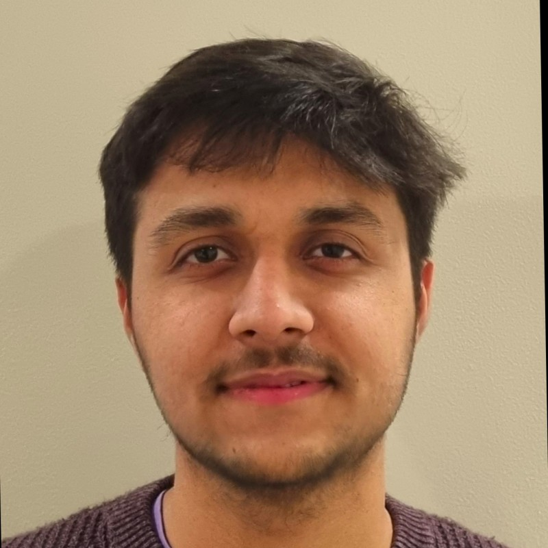

## Meet the Team
<h2>Engineering Academic Committee Members</h2>

    
    

        <h3><b>Engineering</b> Rep</h3>
        <h4>Mahmoud Elbeh</h4>
        
Hi everyone! I am delighted to be serving this year as the chair of the engineering student committee. I am particularly interested in developing non-invasive diagnostic tools using nano particles -which I also use in developing drug delivery platforms! Happy to always chat about anything related to bioengineering

    

    
    

        <h3><b>Bioengineering</b> Rep</h3>
        <h4>Rashik Chand</h4>
        
Hi! I am Rashik. I'm a senior majoring in bioengineering and am excited to be serving as the BioEng representative. I am involved with the Bioengineering Society SIG and Biomedical Engineering Society (BMES). I have been a part of the NYUAD iGEM team for almost three semesters, first as head of labs and now as team leader. I am passionate about tissue engineering and regenerative medicine, and am researching on bioprinting at the Vijay Lab. Feel free to reach out to me regarding anything from the bioengineering major. I will try my best to ensure you have an amazing experience as a bioengineer at NYUAD!

    

    
    

        <h3><b>Mechanical Engineering</b> Rep</h3>
        <h4>Vale Juarez</h4>
        
 Hi! I'm Valentina, a senior in Mechanical Engineering, and I'mexcited to be taking on the role of MechEng representative. My passion lies in the world of composite materials and structural mechanics, and I'm particularly fascinated by their applications in aeronautical and astronautical systems. This semester, I'm actively involved in several engineering-related Special Interest Groups (SIGs), including ASME, weSTEM, and the Aerospace SIG. I'm looking forwards to connect with other engineers, so please feel free to reach out – I'm always up for a good chat!

    
 

    
    

        <h3><b>General Engineering</b> Rep</h3>
        <h4>Aalia Imran</h4>
        
Hello! I'm Aalia, a sophomore majoring in Computer Engineering. I am particularly interested in applications of Engineering in healthcare. I'll be serving as the General Engineering representative, feel free to reach out to me with any questions you have !

    

    
    

        <h3><b>Civil Engineering</b> Rep</h3>
        <h4>Mayher Matharu</h4>
        
Hello, I'm Mayher! I'm a CivE senior with a minor in art. I'm interested in labour ethics, construction/project management, and structural design. My interests outside of class include Sustained Dialogue, cooking/baking, reading comics, and tea (fun fact: I have about 50 kinds of tea right now). I've been part of WeSTEM/WiSTEM clubs since high school, including as a mentor at NYUAD. You can reach out to me at mkm9848@nyu.edu if you have any questions about the civil engineering major/classes/capstone (spoilers: I was very indecisive about the major but really love it, and CivE capstone is looking good so far). I'm also happy to discuss my experiences a woman in STEM, my time in New York, or the stress of being an engineer at NYUAD. Of course, I'm always here to help with any CivE course/professor issues like unreasonable workload or wanting a new elective offered.

    

    
    

        <h3><b>Computer Engineering</b> Rep</h3>
        <h4>Aya Elmir</h4>
        
to be filled...

    

    
    

        <h3><b>Electrical Engineering</b> Rep</h3>
        <h4>Niraj Pudasaini</h4>
        
Hey everyone! I'm Niraj, a senior in Electrical Engineering. I've got an interest in exploring the crossroads of Robotics and Machine Learning - think of it as teaching robots to think a bit, without letting them take over the world! As an EE rep, my goal is to gather students' feedback and work to improve your experience as electrical engineering students. Feel free to reach out ;) 

    

